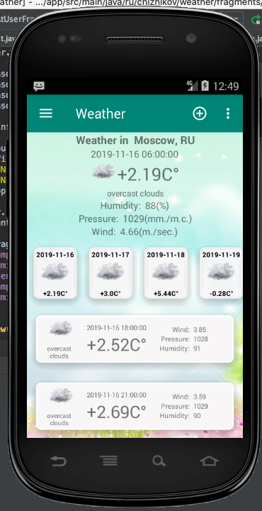
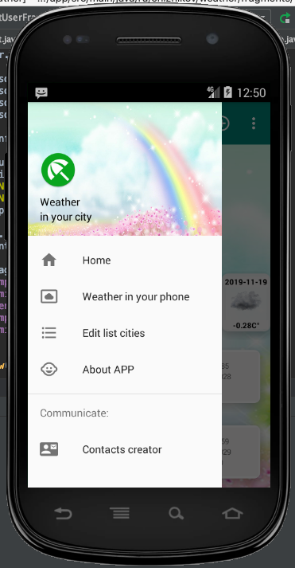
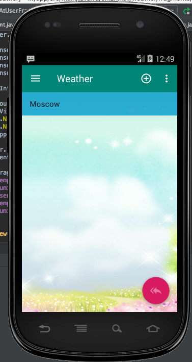
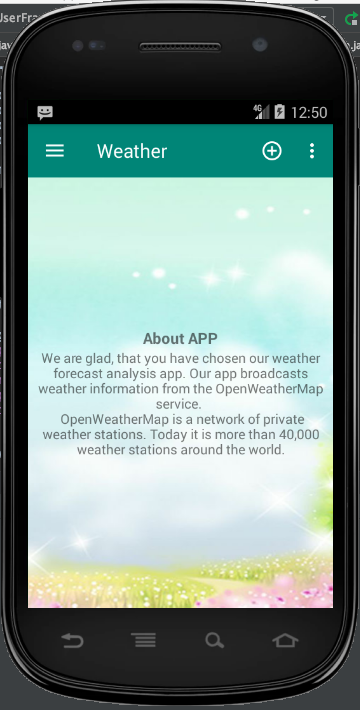
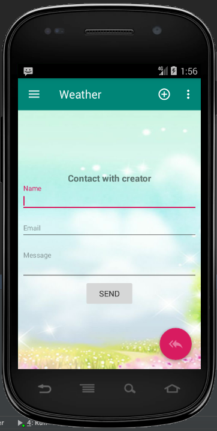
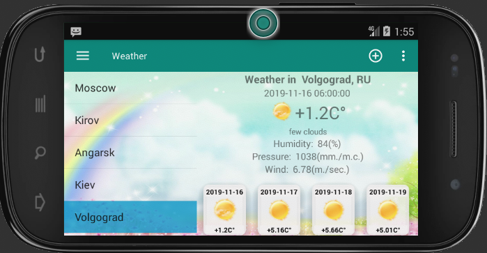

# Weather

Погодное приложение.

Ретранслирует прогноз погоды с 40000 частных метеостанций

Настраиваемый список городов 

Прогноз погоды на 5 дней.

В каждом дне разбивка прогноза каждые 3 часа.

Интерфейс: Material Design, Fragments, Recycler, SQLite

Интернет: Retrofit, Rest.

Язык: Engish, Russian

